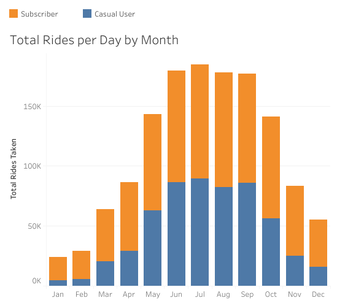
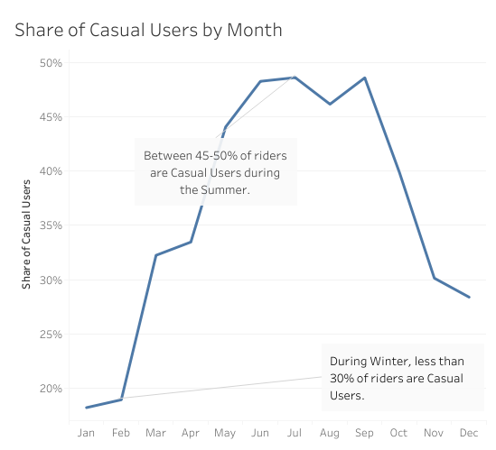
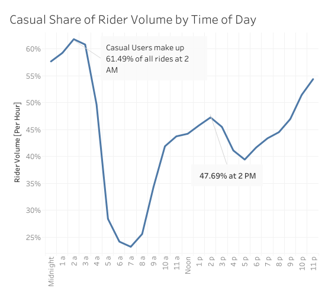
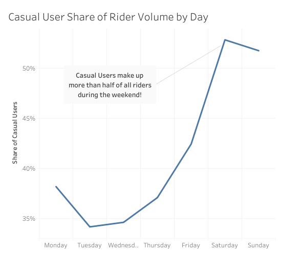
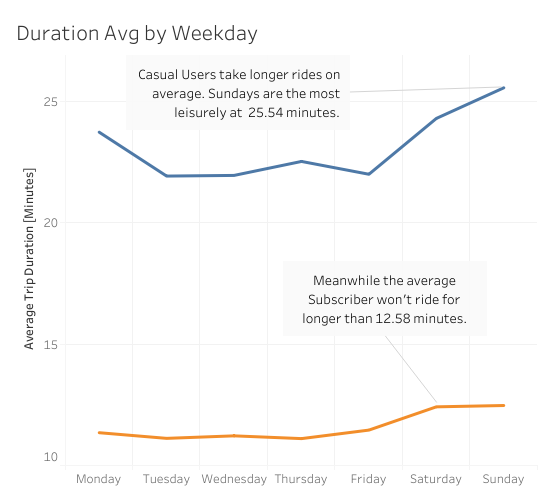
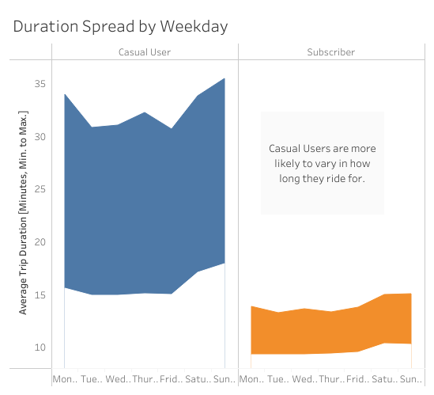
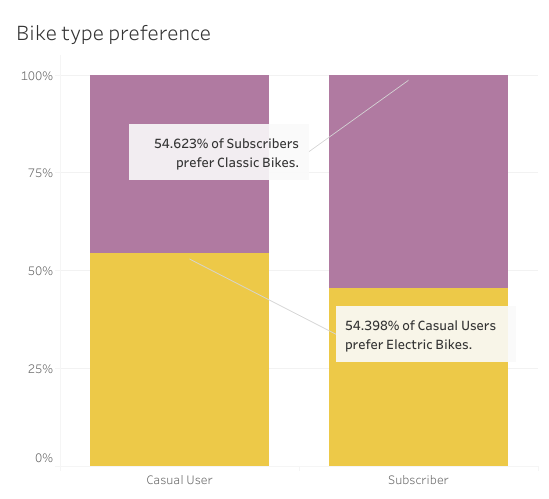

# Cyclistic

---

In this case study, I assume the role of an analyst for a fictional company called Cyclistic based in Chicago. They provide a bike sharing service similar to Lime. My manager, the director of marketing, believes that the company’s future success depends on maximizing the number of annual memberships. 

### How are Subscribers different from Casual Users?

My task is to understand how casual riders and annual members use Cyclistic bikes differently. From these insights, we will design a new marketing strategy to convert casual riders into annual members.

### Data Preparation and Cleaning Details

I'm given access to a set of CSV files. They are organized by month, and have had all private user data stripped. [Here I've documented the steps I took to clean and process the data, included SQL queries.](cleaninglog.md)

### When do Casual Users ride?

---

For reference, people take more rides overall in the Summer and fewer in the Winter. There are generally fewer Casual Users than Subscribers.

Nearly 50% of all riders are Casual Users during the Summer months, but this drops to less than 20% in the Winter.

From day to day, Subscriber use peaks at 8 AM and 5 PM during the week. Casual users also peak around 5 PM.

Casual Users typically make up less than 40% of rides during the week, but this shoots up to around 52% over the weekend. 

### How long do Casual Users ride?

---

A large difference between the two groups is ride length. Casual Users tend to take longer rides, and the longest ride is a lot longer than the shortest. Compared to Subscribers, who usually stay within a tight range of relatively short rides. 

### What kind of bikes do Casual Users ride?

---

# Cyclistic is for Getting to Work.

---

### Subscribers ride during the week, Casual Users ride during the weekend

Subscriber use is steady over Mon-Fri and dips over the weekend. Casual Users are the opposite, and ride less during the week but peak over the weekend. However, there is a peak around 5 pm for Casual users, which suggests that a large portion of non-subscribers use the bikes to return home from work.

### Subscribers = Commuters

Subscriber use peaks at 8 AM and 5 PM during the week, suggesting that they rely on bikes to get to and from work.

### Subscribers ride quick and to the point, Casual Users stop and smell the roses

Subscribers ride for 15 minutes on average, with very little deviation. Casual Users show a lot more variance from their shortest ride of 15 minutes to their longest of 30. This suggests that Subscribers take the same route consistently, that they were likely to subscribe because they lived near a route that only took 15 minutes, and that they aren't interested in taking their time when they ride.

# Recommendations

---

### Attract Commuters

Cyclistic is apparently very useful for users who need our service to get to and from work every day. We can capitalize on this by: 

1. Marketing ourselves as a service for commuters and promote the benefits of holding an annual subscription.  
2. placing more bike stations at and within fifteen minutes of where people work. 

### Entice Leisure Riders

Plenty of people ride on the weekend but don't think it's worth it to subscribe. We can encourage these users by offering a annual "weekends only" pass at a lower rate.
